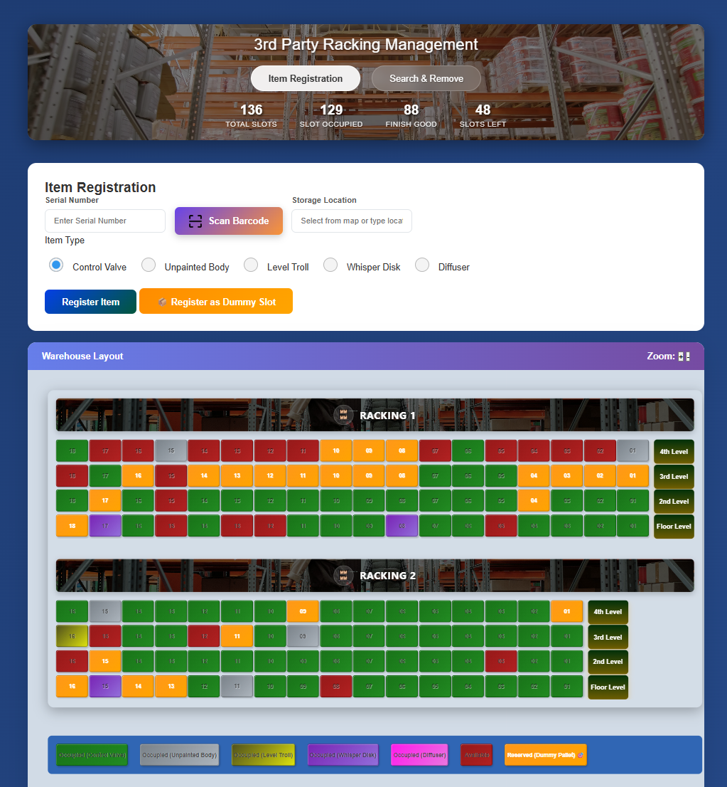
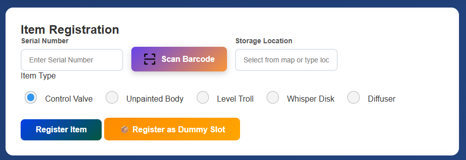
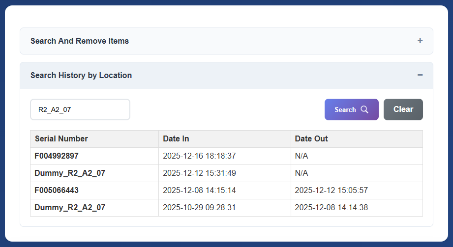

# Warehouse Tracking System (3rd Party Racking Management)

A comprehensive web-based solution for managing and tracking items within a warehouse racking system. This application provides real-time visibility into storage capacity, item locations, and history.





## Overview

Managing warehouse storage manually can be slow and error-prone. This project helps users manage rack positions, monitor inventory placement, and locate items faster through a structured digital system.

## 🚀 Key Features

- **Manage warehouse racks, shelves, and storage locations**: Visualize and organize your physical storage space.
- **Add, edit, and remove inventory records**: Full CRUD operations for item management.
- **Search items by name, code, or location**: Quickly find exactly what you're looking for.
- **Update stock information**: Real-time status updates (In Storage, Out Storage, Reserved).
- **Organized dashboard for daily operations**: Statistical overview of warehouse occupancy.
- **Responsive interface for desktop use**: Optimized for terminal and office workstations.
- **Barcode/QR Scanner**: Integrated scanner support for rapid data entry.

## 🛠️ Tech Stack

- **Backend**: Python 3.x, Flask
- **Database**: Microsoft Access (`.accdb`) using `pyodbc`
- **Frontend**: HTML5, CSS3, JavaScript (Vanilla)
- **Scanner Library**: [html5-qrcode](https://github.com/mebjas/html5-qrcode)

## ⚙️ Installation & Setup

### Prerequisites

1.  **Python**: Ensure Python 3.x is installed.
2.  **Microsoft Access Database Engine**: Required for the `pyodbc` driver to connect to `.accdb` files.
3.  **ODBC Driver**: Ensure the "Microsoft Access Driver (*.mdb, *.accdb)" is available in your system's ODBC Data Source Administrator.

### Setup Steps

1.  **Clone the Repository**:
    ```bash
    git clone https://github.com/zaharscript/warehouse-racking.git
    cd warehouse-racking
    ```

2.  **Install Dependencies**:
    ```bash
    pip install flask pyodbc
    ```

3.  **Database Configuration**:
    - Update the `DB_PATH` in `app.py` to point to the absolute path of your `Warehouse-tracking.accdb` file.

4.  **Run the Application**:
    ```bash
    python app.py
    ```

## 📂 Usage

1.  **Create storage racks and sections**: Define your warehouse layout in the database.
2.  **Register inventory items**: Use the Item Registration tab to add new stock.
3.  **Assign items to locations**: Select slots from the interactive map to place items.
4.  **Search and update stock records**: Use the Search & Remove tab to locate and push out items.
5.  **Maintain organized warehouse data**: Monitor the statistics bar to manage capacity.

## 🗺️ Roadmap

- [ ] **User Authentication**: Implement login and role-based access control (Admin/Staff).
- [ ] **Mobile Optimization**: Progressive Web App (PWA) support for mobile handheld scanners.
- [ ] **Multi-Warehouse Support**: Manage multiple physical locations from a single dashboard.
- [ ] **Advanced Analytics**: Generate reports on storage trends and item turnover rates.
- [ ] **API Integration**: RESTful API for integration with existing ERP or shipping systems.
- [ ] **Automated Alerts**: Email or SMS notifications for low-stock or long-stored items.

## 🤝 Contributing

Suggestions and improvements are welcome. Fork the repo, create a feature branch, and submit a pull request.

## 📝 Author

Built by **zaharscript**
GitHub: [https://github.com/zaharscript](https://github.com/zaharscript)

---
© 2026 Zaharscript 📎. All rights reserved.
